# Ahmet Erturk Portfolio

## Website URL
https://ahmeterturk.netlify.app/

## Website Repository
https://github.com/ahmetterturk/portfolio

## Purpose
The purpose of this project is to showcase the skills that I have learned in the first couple of weeks and practice them extensively by creating a fully functional portfolio website. 

## Functionality and Features
* Responsive Design
* Navigation Bar
* Footer
* Images
* Buttons
* Image Links
* Semantic Elements

### Responsive Design
The website is responsive to different screen sizes. It is made to be viewed in multiple device types such as computers, tablets and mobile phones. This functionality is achieved using css only and no external css libraries. Properties that make this possible are a combination of `flexbox` and `@media queries`.

### Navigation Bar
The navigation bar component runs through the top of all pages. It is responsive to large and mobile screens. On large screens, the navigation bar is in a single row and its links are listed horizontally. On mobile size screens, the navigation bar collapses to a column view and the links are listed vertically. It is has an interactive design. When hovered over navigation bar links, they grow in size causing a modest animation effect. 

### Footer
The footer component runs through the bottom of all pages. It is uniform throughout the website. It contains a copyright notice and a link to the credits page.
 
### Images
Images are widely used in this project to add visual aesthetic and context to each of their own unique sections. They are responsive to screen size and have individual specifications. They are used both as visual components and links. 

### Buttons
Button components are used in two different pages in this project. In the projects page, they are used as links to direct viewers to the github page of that individual project. In the blogs page, they link viewers to extended versions of the blog. These buttons are interative and they change in colour when hovered over. 

### Image Links
Images are used as links for visual and aesthetic purposes. In the contact page, they are displayed as social media icons and have animation when hovered over. In the about page, there is a pdf icon that downloads a copy of my resume. 

### Semantic Elements
Semantic elements are used to add semantic meaning to html files. These elements are; `nav`, `footer`, `section`, `main`, `article`.

## Sitemap
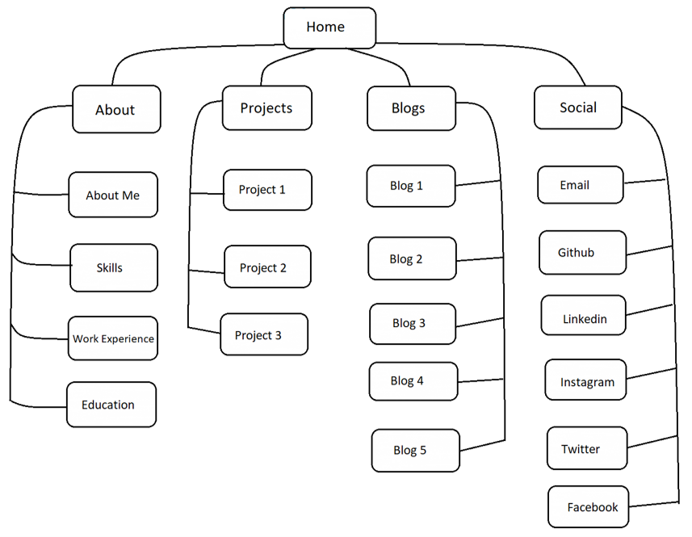

## Screenshots
### Balsamiq Wireframes
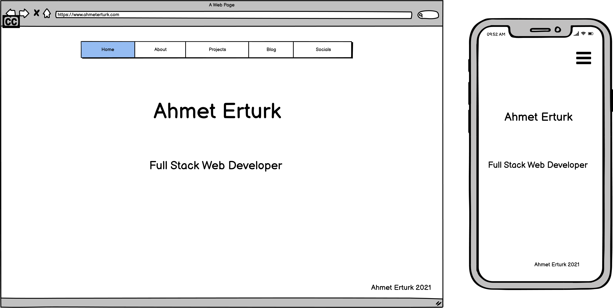
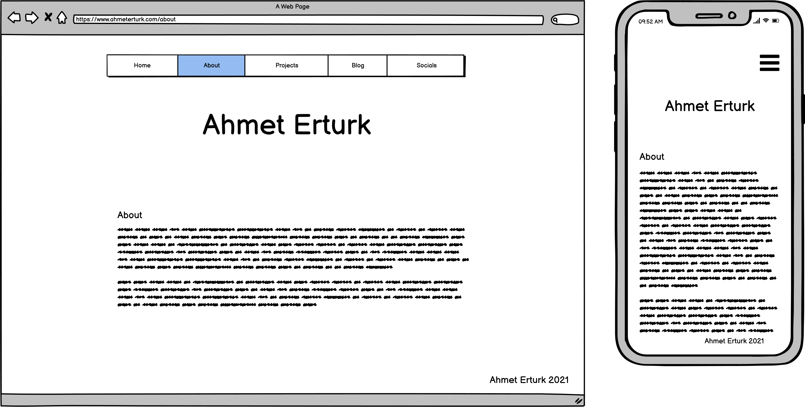
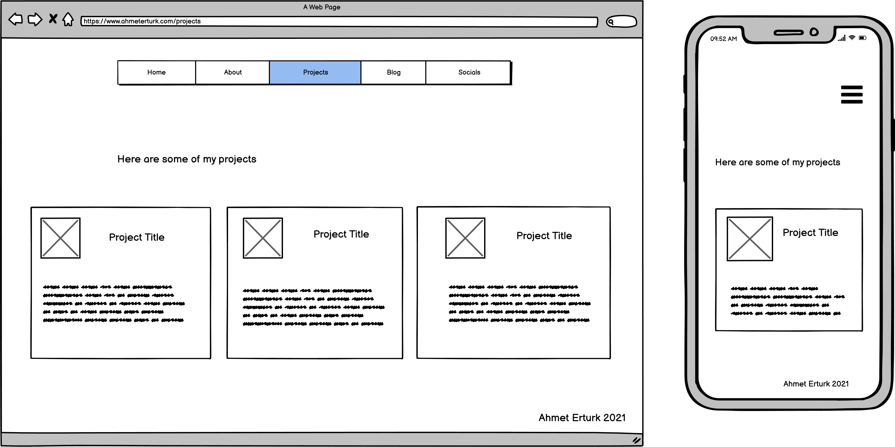
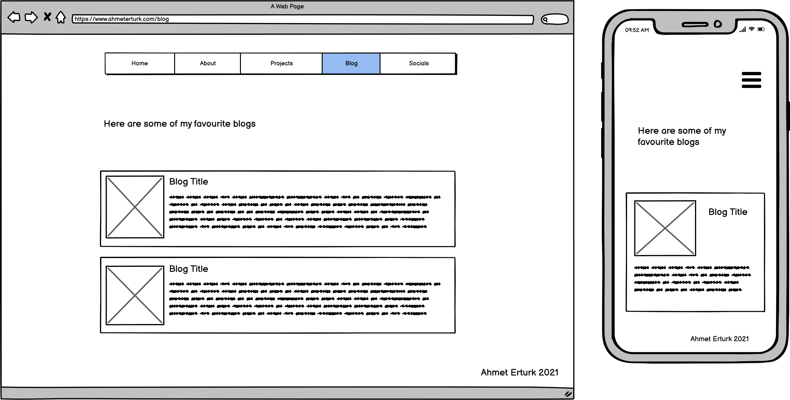
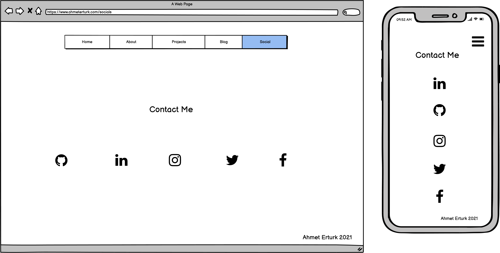

### Website 
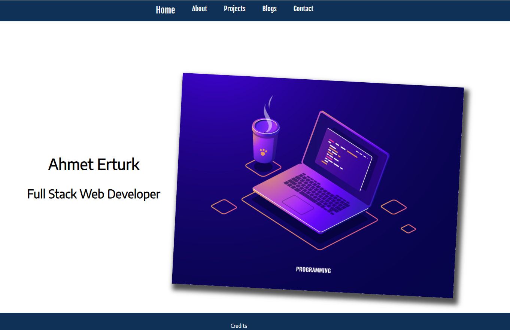
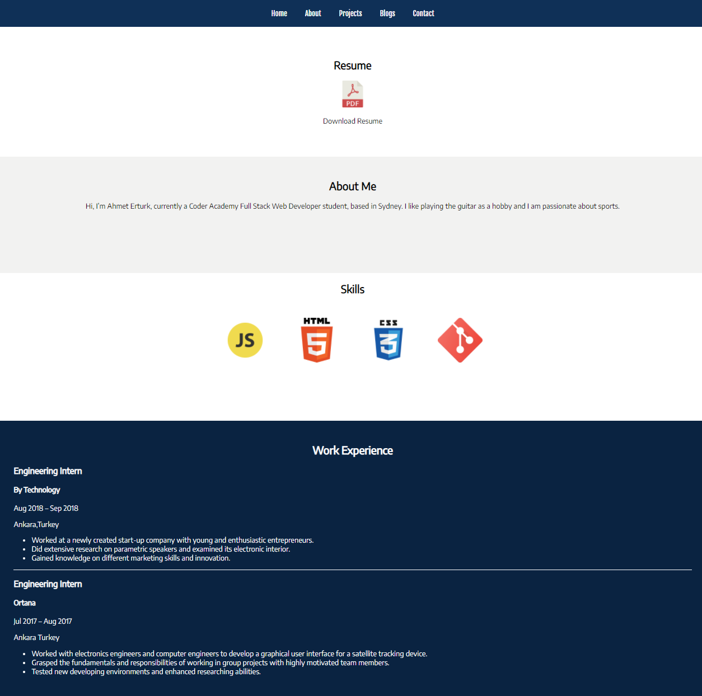
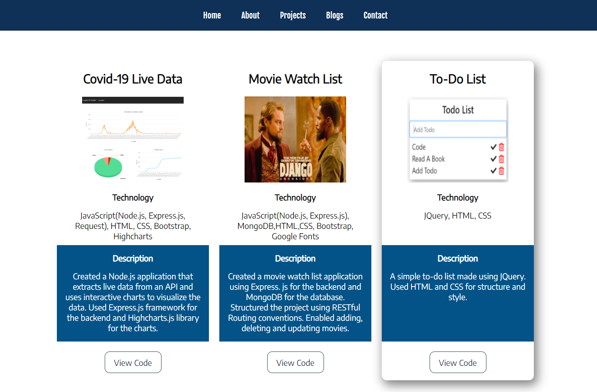
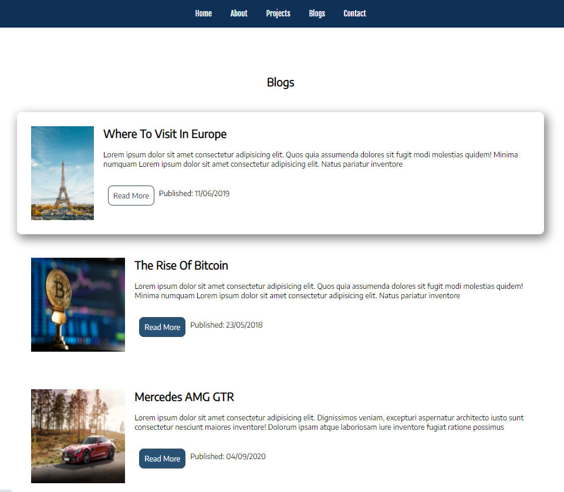
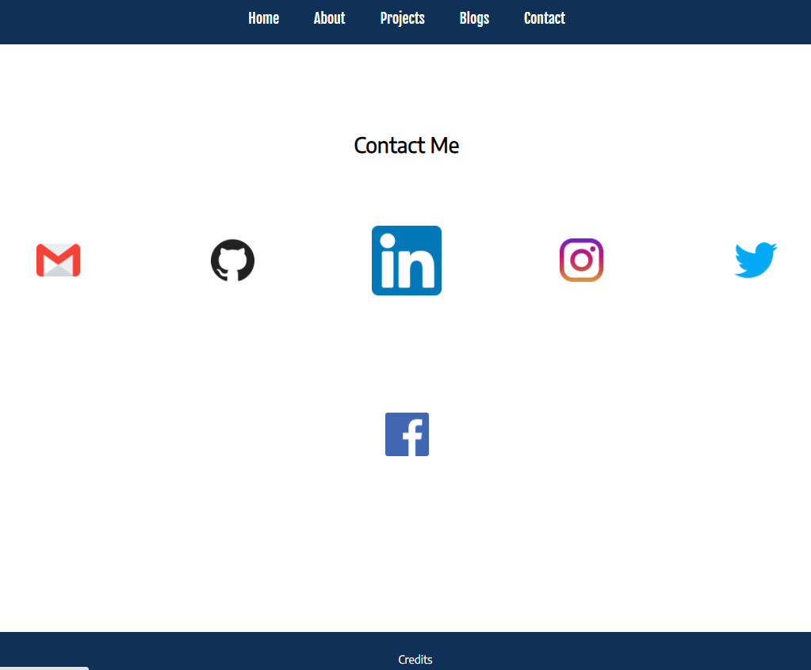
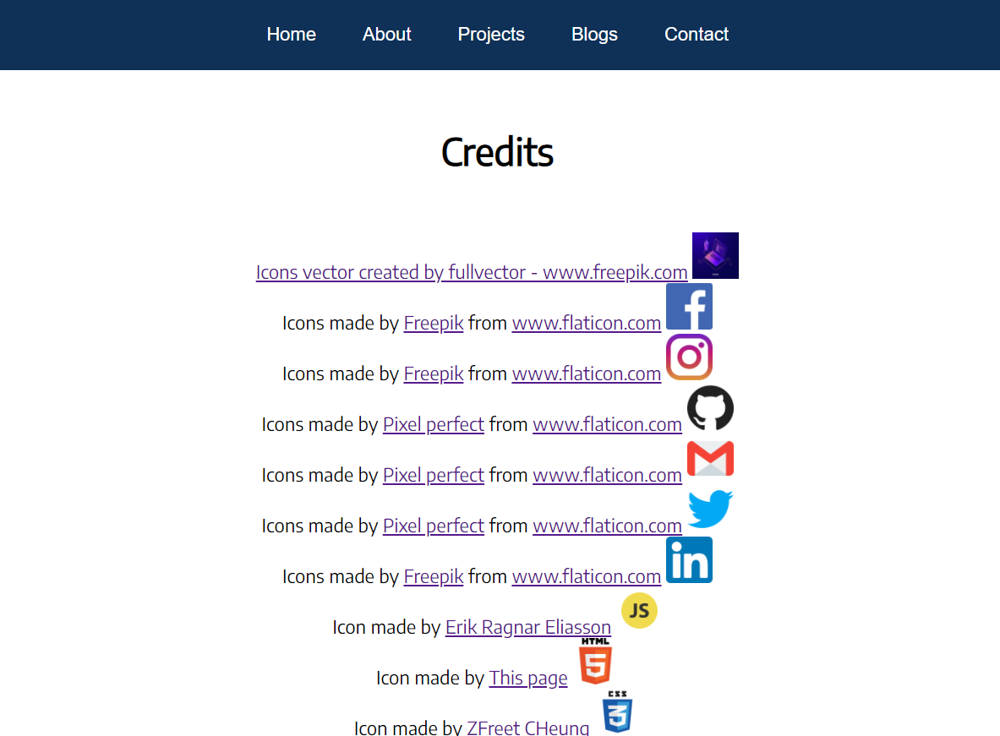

## Target Audience
The target audience of this project is future employers and other developers.

## Tech Stack
* HTML
* CSS 
* Balsamiq Wireframes
* Netlify
